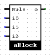
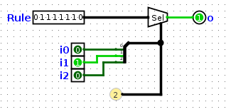
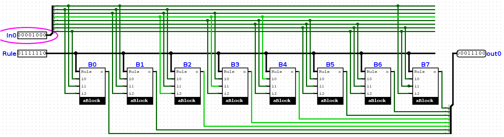

# Cellular Automaton in Logisim

This is the implementation of an 8-bit [Cellular Automaton](http://maker.itnerd.space/what-is-a-cellular-automaton/) in Logisim.

- [Cellular Automaton in Logisim](#cellular-automaton-in-logisim)
    - [Elementary block](#elementary-block)
    - [Cellular Automaton](#cellular-automaton)
    - [Top module](#top-module)
    - [Simulation in Logisim](#simulation-in-logisim)

## Elementary block

This combinational block computes the next generation of a cell given the cell (i1) and it's neighbours (i0 and i2) and the rule (8bit)

 

Basically the 1 bit output is the Nth bit of Rule, where N is {i2,i1,i0}.

## Cellular Automaton

This module is the 8-bit Cellular Automaton: it computes an 8-bit input and outputs 8 bits.

It is a combinational module made of 8 elementary blocks:

 

## Top module

The top module is made of:
- One 8-bit Cellular Automaton
- the output is feedback to the input via a register and wired to a row of 8 LEDs
- the mux on the input feeds the first generation (Seed) upon startup or reset

## Simulation in Logisim

Created using [Logisim](https://github.com/sderrien/logisim-evolution)
